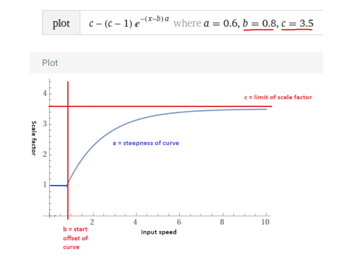
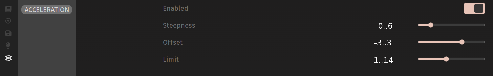

# Mouse acceleration

This feature was born from the frustration of not having a tweakable acceleration curve that could work between OSes and hosts and be specific to one device, catalyzed by multiple users expressing interest.

## Installation

### Installation step 1a (keymap)

Choose this route if you do not maintain a userspace; if you do, then skip to the next step (1b).

Place the `maccel` directory in your keymap directory. For example, if you were using the `via` keymap on a BastardKB Dilemma Max, you'd place it to be `keyboards/bastardkb/dilemma/4x6_4/keymaps/via/maccel/`.

Add the following to the `rules.mk` file in your keymap folder (Create the file if not present):
```make
# MACCEL
SRC += ./maccel/maccel.c
ifeq ($(strip $(VIA_ENABLE)), yes)
	ifeq ($(strip $(MACCEL_VIA_ENABLE)), yes)
		SRC += ./maccel/maccel_via.c
	endif
endif
OPT_DEFS += -DMACCEL_ENABLE
```

Add to your `keymap.c`, near the top:
```c
#ifdef MACCEL_ENABLE
    #include "maccel/maccel.h"
#endif
```

Continue with "Installation step 2 (common)", below.

### Installation step 1b (userspace)

Choose this route if you maintain a userspace; if you don't, then skip to the next step (2).

Place the `maccel` directory within `features/` in your userspace. For example, if your username was burkfers, you'd place it to be `users/burkfers/features/maccel/`.

Add to `rules.mk` in the top level of your userspace (Create it if not present):

```make
MACCEL_ENABLE = yes

include $(USER_PATH)/features/maccel/rules.mk
```

You may instead place `MACCEL_ENABLE = yes` in your keymap's `rules.mk` if you wish to only enable maccel for some boards.

Add to your userspace source file, near the top:
```c
#ifdef MACCEL_ENABLE
    #include "features/maccel/maccel.h"
#endif
```

Continue with "Installation step 2 (common)", below.

### Installation step 2 (common)

Make sure the `pointing_device_task_user()` function in your `keymap.c` or userspace-sources exists, and contains the following code:
```c
report_mouse_t pointing_device_task_user(report_mouse_t mouse_report) {
    // ...
#ifdef MACCEL_ENABLE
    return pointing_device_task_maccel(mouse_report);
#endif
}
```

To minimize the chance of maxing out the mouse reports, it is recommended to define extended mouse reports in your config.h:
```c
#define MOUSE_EXTENDED_REPORT
```

See the section on runtime adjusting by keycodes and on via support for installation steps for these optional features.

## Configuration
Before configuring maccel, make sure you have turned off your OS acceleration settings: On Windows, this setting is called "Enhance pointer precision". And make sure there isn't any 3rd party mouse acceleration software running. 

Several characteristics of the acceleration curve can be tweaked by adding relevant defines to `config.h`:
```c
#define MACCEL_TAKEOFF 2.0      // lower/higher value = curve takes off more smoothly/abruptly
#define MACCEL_GROWTH_RATE 0.25 // lower/higher value = curve reaches its upper limit slower/faster 
#define MACCEL_OFFSET 2.2       // lower/higher value = acceleration kicks in earlier/later
#define MACCEL_LIMIT 0.2        // lower limit of accel curve (minimum acceleration factor)
```

The graph below shows the acceleration curve. You can interpret this graph as follows: the horizontal axis is input velocity (ie. how fast you are physically moving your mouse/trackball/trackpad); the vertical axis is the acceleration factor, which is the factor with which the input velocity will be multiplied, resulting in your new output velocity on screen. You can also understand this as a DPI scaling factor: the curve maxes out at 1, meaning your mouse sensitivity will never go higher than your default DPI setting; at the start of the curve your sensitivity is scaled down to a minimum that can be set by the LIMIT variable. The limit in this example is 0.2, which means at the lowest velocity your mouse sensitivity is scaled down to an equivalent of 0.2 times your default DPI.

[](https://www.desmos.com/calculator/k9vr0y2gev)

**If you click on the image of the curve**, you will be linked to Desmos, where you can play around with the variables to understand how each of them affect the shape of the curve. But in short:

* The TAKEOFF variable controls how smoothly or abruptly the acceleration curve takes off. A higher value will make it take off more abruptly, a lower value smoothens out the start of the curve.

* The GROWTH_RATE variable sets the growth rate of the acceleration curve. A lower value will result in a flatter curve which takes longer to reach its LIMIT. A higher value will result in a steeper curve, which will reach its LIMIT faster.

* The OFFSET variable moves the entire curve towards the right. Offsetting the curve to the right means acceleration will kick in later, which is useful for low speed precision - in effect what you would otherwise have used SNIPING mode for. The maccel feature basically eliminates the need for a sniping mode.

* The LIMIT variable sets the lower limit for the acceleration curve. This is the minimum acceleration factor at which the curve will start. In effect this adjusts the sensitivity for low speed precision movements.

* The upper limit of the curve is fixed at 1, which means that at high speed sensitivity equals your default DPI. If you want to adjust high speed sensitivity, adjust your DPI.

A good starting point for tweaking your settings, is to set your default DPI slightly higher than what you'd use without acceleration. Then set your LIMIT variable to a factor that would scale down to what you normally might have set your sniping DPI. For example, if your usual default DPI is 900, you might set it now to 1000. And if your usual sniping DPI is 200, you might set your LIMIT to 0.2 (0.2*1000=200). From there you can start playing around with the variables until you arrive at something to your liking.

**Debug console**: To aid in dialing in your settings just right, a debug mode exists to print mathy details to the console. The debug console will print your current DPI setting and variable settings, as well as the acceleration factor, the input and output velocity, and the input and output distance. Refer to the QMK documentation on how to [*enable the console and debugging*](https://docs.qmk.fm/#/faq_debug?id=debugging), then enable mouse acceleration debugging by adding the following defines in `config.h`:
```c
#define MACCEL_DEBUG
/*
 * Requires enabling float support for printf!
 */
#undef PRINTF_SUPPORT_DECIMAL_SPECIFIERS
#define PRINTF_SUPPORT_DECIMAL_SPECIFIERS 1
```

## Runtime adjusting of curve parameters by keycodes (optional)

### Additional installation steps for adding keycodes:

To use keycodes to adjust the parameters without recompiling, two more build steps are required.
First, add five keycodes to your keycode enum. You may choose different names, as long as you use the same names in the following step. If you are not yet using custom keycodes, add the following snippet to `keymap.c`:
```c
enum my_keycodes {
    MA_TOGGLE = QK_USER,    // toggle mouse acceleration
    MA_TAKEOFF,   // mouse acceleration curve takeoff (initial acceleration) step key
    MA_GROWTH_RATE,         // mouse acceleration curve growth rate step key
    MA_OFFSET,              // mouse acceleration curve offset step key
    MA_LIMIT,               // mouse acceleration curve limit step key
};
```
Next, add another shim, this time to `process_record_user`. If you have not previously implemented this function, simply place the following snippet in your `keymap.c`:
```c
bool process_record_user(uint16_t keycode, keyrecord_t *record) {
    if (!process_record_maccel(keycode, record, MA_TOGGLE, MA_TAKEOFF, MA_GROWTH_RATE, MA_OFFSET, MA_LIMIT)) {
        return false;
    }
    /* insert your own macros here */
    return true;
}
```
Take care to use the same names that you used in the previous step.

See the configuration section on how to enable this feature once you have set it up.

Once the additional keycodes and shim are added, this feature can be enabled in `config.h`:
```
#define MACCEL_USE_KEYCODES
```

Lastly, place the new keycodes on your keymap.

---
### Acceleration keycode usage:

The four keycodes can be used to adjust the curve parameters. This is *not* persisted unless you also enabled the via option - Adjusted values are printed to the console to aid in finding the right settings for `config.h`.
The step keys will adjust the parameters by the following amounts, which can optionally be adjusted:

| Parameter    | Default step value | Define name               |
| ---          | ---                | ---                       |
| Takeoff      | `+0.01`            | `MACCEL_TAKEOFF_STEP`     |
| Growth rate  | `+0.01`            | `MACCEL_GROWTH_RATE_STEP` |
| Offset       | `+0.1`             | `MACCEL_OFFSET_STEP`      |
| Limit        | `+0.01`            | `MACCEL_LIMIT_STEP`       |

The modifier keys can be used to alter the step effect:

| Modifier    | Effect                                    |
| ---         | ---                                       |
| Shift       | Reverse step (subtract instead of adding) |
| Control     | `step value * 10` (Step 10 times faster)  |

Modifiers can be combined.

With every adjustment, an informational message is printed to the console.

## VIA support (optional)
Mouse acceleration can now be configured though via. 


\* *note that VIA unfortunately cannot show the numeric values for the sliders, so you will still need to use the debug console to monitor any changes you make to the variables. (The numbers shown in the image have just been edited in to indicate the range of the sliders).*

### Additional installation steps for adding VIA support:
If your keyboard is not already supported by via, you must first [create a via definition](https://www.caniusevia.com/docs/specification).

Add the following to `rules.mk`, *before* the include added previously:
```make
MACCEL_VIA_ENABLE = yes
``````

Add a shim to `keyboard_post_init_user`:
```c
void keyboard_post_init_user(void) {
    keyboard_post_init_maccel();
}
```

Add the entire function to your keymap if not already present, or insert the call to `keyboard_post_init_maccel` in your existing implementation.

You must also configure the size of the EEPROM user block by placing the following define in `config.h`:
```c
#define EECONFIG_USER_DATA_SIZE 20
```

Please be aware of the following caveats:
- The maccel via support takes over your eeprom user block. If you are already storing values in eeprom in your userspace, you must manually merge the features.
- The maccel via support implements `via_custom_value_command_kb`. This is not compatible with keyboards that already add custom features to via. If your keyboard has custom via configuration, you must manually shim the keyboard-level callback.

Create a custom via definition: Find your keyboard's via definition in the [via keyboards repository](https://github.com/the-via/keyboards/tree/master/v3) if you did not create your own.

Extend its `menus` configuration by placing the [menu definition](assets/via.json) on the `menu` node. Completed examples are provided for these keyboards:

- [Charybdis 3x5](assets/charybdis_3x5.json)
- [Charybdis 3x6](assets/charybdis_3x6.json)
- [Charybdis 4x6](assets/charybdis_4x6.json)
- [Dilemma v2](assets/dilemma_v2.json)
- [Dilemma Max](assets/dilemma_max.json)

Finally, after flashing the firmware to your board, load the custom via definition in the design tab in [via](https://usevia.app) (you may have to enable the "Show Design Tab" option in the settings).

# Setup checklist

- Place files in either:
    - `keyboards/YOUR KEYBOARD/keymaps/YOUR KEYMAP/maccel/` 
    - OR in `users/YOUR_USERNAME/features/maccel/`
- Include `maccel/rules.mk` in your `rules.mk`
- Shim `pointing_device_task_user`
- Add configuration defines for parameters and optionally debugging
- Optional: Config keycodes:
  - Enable keycode support by define
  - Create five keycodes in the keycode enum
  - Shim `process_record_user`
- Optional: VIA support:
  - Enable in `rules.mk`
  - Shim `keyboard_post_init_user`
  - Set user eeprom data block size
  - Create custom via json and side-load it in the web app

## Limitations

**Mac OS compatibility:** 

*It's complicated...* Yes, you can use maccel with MacOS, but there is some caveats to consider:
* Even after disabling the OS level acceleration, macOS does some kind of post processing to smooth cursor movement, which you cannot disable. This will distort the result of maccel, which will make it harder to dial in, and the result may or may not be satisfactory.
* Secondly, the OS level acceleration of macOS seems to be quite good, so whether maccel (with the smoothing issue in mind) will actually be an improvement is debatable. We've heard opinions both ways from macOS users. So in other words, your mileage may vary. 

**Sensor compatibility:**
* PMW3360: fully compatible, elaborately tested
* Other PMW33xx sensors will very likely perform equally well (but not tested so far)
* adns5050: compatible, tested
* Cirque trackpad: compatible, limited testing
* Azoteq: not compatible, due to issues in how the driver handles DPI settings.
* No other QMK compatible sensors have been tested so far. We expect most sensors to work fine with maccel, but there could always be unexpected driver/firmware related conflicts we are not aware of.
* If you are using maccel successfully (or unsuccessfully) with a sensor that isn't listed here, we'd love to hear!

**MCU compatibility:**
Despite our initial worries about the extensive use of floating point operations likely not working well on AVR, it's been tested and works adequately. However, firmware size might be an issue. Depending on what other QMK features you have enabled, you may need to make some compromises to fit maccel.

It is currently unknown how the un-throttled polling when used with `POINTING_DEVICE_MOTION_PIN` would interact with the expensive calculations.

## Breaking changes

### 2024 March 12

This new release changes the acceleration curve from a up-scaling curve to a down-scaling curve, to match how other acceleration tools work, and to avoid forcing users to set a very low DPI setting - this had been the goal from the start, but it took until now to overcome the technical challenges to make this work smoothly.

See the configuration bit of this readme for an explanation of how the new curve works. This change means that you will have to readjust your variables; but do not worry, it is fairly easy to get this dialed in to *exactly* to how you had it set before:

* First, change your default DPI: $DPI_{new} = DPI_{old} * {limit}_{old}$
* Second, change your LIMIT variable (which is now lower instead of upper limit): $limit_{new} = \dfrac{DPI_{old}}{DPI_{new}}$
* Your other variables can remain the same.
* If using via, make sure to clear EEPROM for the new settings to take effect.

### 2024 March 10

A keycode for toggling mouse acceleration was added: If you enabled maccel keycodes, you must add a fifth keycode to your enum and add it to the shim between the record and takeoff arguments. Don't forget to place it on your keymap!

### 2024 March 1

If you're updating from a previous version, you will have to make manual adjustments to your integration. Refer to the instructions for details on what the current version expects:
- The parameters have changed names and were expanded:
  - `STEEPNESS` is now `GROWTH_RATE`, `TAKEOFF` was added
    - Change the define names in your `config.h` for the parameter settings and step settings (if applicable)
    - If using keycodes: Change the shim in `process_record_user` to call a fourth keycode
- If using via: Clear EEPROM and use a new via json. Do NOT load a previous via backup without adjusting the maccel values to the new format!

If you set GROWTH_RATE to your previous value of `STEEPNESS` and keep `TAKEOFF` at a high value (eg. `10`), the behavior will be similar to previous versions.

## Release history
- 2024 March 12 - Release of improved down scaling accel curve
- 2024 March 10 - Addition of toggle keycode
- 2024 March 1 - Release of new four-parameter acceleration curve
- 2024 February 23 - New four-parameter acceleration curve and improved documentation
- 2024 February 07 - Experimental new DPI correction to achieve consistent acceleration behavior across different user DPI settings.
- 2024 February 06 - First release candidate. Feedback welcome!

## Credits
Thanks to everyone who helped!
Including, but not limited to:
- Wimads (@wimads) and burkfers (@burkfers) wrote most of the code
- ankostis (@ankostis) for catalyzing discussion about improving the acceleration curve and providing several enhancements
- Quentin (@balanstik) for insightful commentary on the math, and testing
- ouglop (@ouglop) for insightful commentary on the math
- Drashna Jael're (@drashna) for coding tips and their invaluable bag of magic C tricks
- bcl (@energetic_beagle_99245) for testing on AVR with an adns5050 sensor
