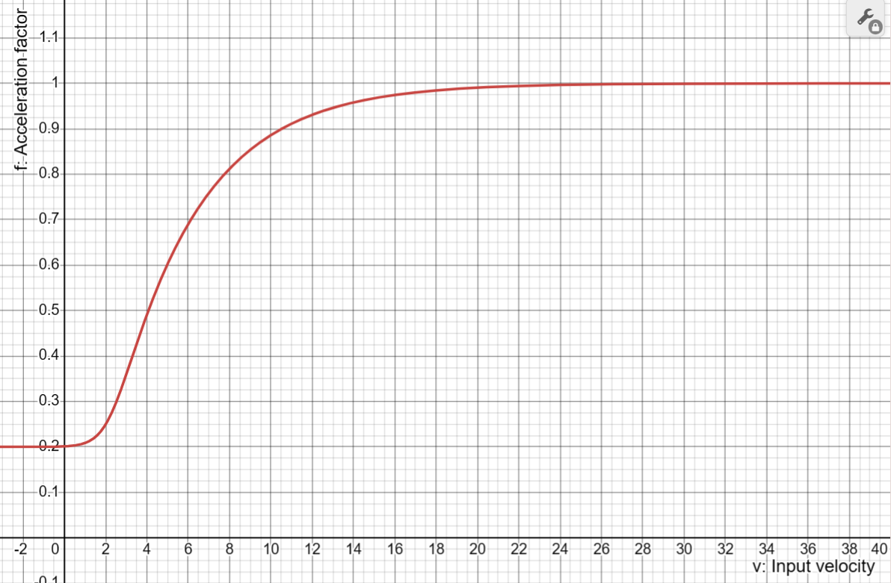

# Mouse acceleration

This feature was born from the frustration of not having a tweakable acceleration curve that could work between OSes and hosts and be specific to one device, catalysed by multiple users expressing interest.

## Installation

You have 2 options of how to build it.


**1. First build option:**


First copy the `maccel.c` and `maccel.h` files into your keymap folder.

Then simply add the following code at the top of your keymap.c file:
```c
#include "maccel.c"

report_mouse_t pointing_device_task_user(report_mouse_t mouse_report) {
    return pointing_device_task_maccel(mouse_report);
}
```

If you already have a `pointing_device_task_user` in your keymap, then add the `pointing_device_task_maccel` line to that instead.

This is an easy option if you are not maintaining a userspace.


**2. Second build option for those maintaining a user space:**

First, place the `maccel/` directory in `users/YOUR_USERNAME/features/` (you may omit the readme and assets).

Next, include `rules.mk` in your `rules.mk`:
```make
-include $(USER_PATH)/features/maccel/rules.mk
```

This will add `maccel.c` to your build process, and additionally include `maccel_via.c` if you have via enabled.

---

Next, add the acceleration shim to your `pointing_device_task_user`:
```c
report_mouse_t pointing_device_task_user(report_mouse_t mouse_report) {
    // ...
    return pointing_device_task_maccel(mouse_report);
}
```
If you have chosen to use the build system, you will also need to `#include "maccel.h`.

You may call it at the beginning if you wish to use the accelerated mouse report for your other code.

If you have not previously implemented a `pointing_device_task_user` (ie. your keymap has no such function), add one to `keymap.c`:
```c
report_mouse_t pointing_device_task_user(report_mouse_t mouse_report) {
    return pointing_device_task_maccel(mouse_report);
}
```

** 3. Runtime parameter adjusting with custom keycodes (optional)

To use keycodes to adjust the parameters without recompiling, two more steps are required.
First, add three keycodes to your keycode enum. You may choose different names, as long as you use the same names in the following step. If you are not yet using custom keycodes, add the following snippet to `keymap.c`:
```c
enum my_keycodes {
    MA_STEEPNESS = QK_USER, // mouse acceleration curve steepness step key
    MA_OFFSET,              // mouse acceleration curve offset step key
    MA_LIMIT,               // mouse acceleration curve limit step key
};
```
Next, add another shim, this time to `process_record_user`. If you have not previously implemented this function, simply place the following snippet in your `keymap.c`:
```c
bool process_record_user(uint16_t keycode, keyrecord_t *record) {
    if (!process_record_maccel(keycode, record, MA_STEEPNESS, MA_OFFSET, MA_LIMIT)) {
        return false;
    }
    return true;
}
```
Take care to use the same names that you used in the previous step.

See the configuration section on how to enable this feature once you have set it up.

## Configuration

This accel curve works in opposite direction from what you may be used to from other acceleration tools, due to technical limitation in QMK. It scales pointer sensitivity upwards rather than downwards, which means you will likely have to lower your DPI setting from what you'd normally do.

Three characteristics of the acceleration curve can be tweaked by adding relevant defines to `config.h`,
with these values as defaults:

```c
#define MACCEL_STEEPNESS 1.0 // steepness of accel sigmoid-curve
#define MACCEL_OFFSET 5.0    // midpoint velocity of accel sigmoid-curve
#define MACCEL_LIMIT 6.0     // upper limit of accel sigmoid-curve
```

[]()

To find a curve that suits your needs, either run the [included python program](./plotaccel.py) to plot the curve 
or plot it in [Wolfram Alpha](https://www.wolframalpha.com/input?i=plot++1%2B%28c-1%29%2F%281+%2B+e%5E%28-%28x-b%29*a%29%29+with+a%3D1+with+b%3D5+with+c%3D6+from+x%3D-0.1+to+10+from+y%3D-0.5+to+6.5).

Interpret this graph as follows: horizontal x-axis is *input velocity* (ie. how fast you are physically moving your mouse/trackball/trackpad); vertical y-axis is the *acceleration factor*, which is the factor with which the input speed will be multiplied, resulting in your new output speed on screen. You can also understand this as a DPI scaling factor: at the start of the curve the factor is 1, and your mouse sensitivity will be equal to your default DPI setting. At the end of the curve, the factor approaches a limit which can be set by the LIMIT variable. The limit is 4 in this example and will result in a maximum mouse sensitivity of 4pp times your default DPI.

The OFFSET variable moves the center of the curve towards the right, which means acceleration will kick in only after a certain velocity is reached. This is useful for low speed precision movements, in effect what you might normally use SNIPING mode for - and this is intended to entirely replace SNIPING mode.

The STEEPNESS variable sets the steepness of the acceleration curve. A lower value will result in a flatter curve which takes longer to reach its LIMIT. A higher value will result in a steeper curve, which will reach its LIMIT faster.

A good starting point for tweaking your settings, is to set your default DPI to what you'd normally have set your sniping DPI. Then set the LIMIT variable to a factor that results in slightly higher than your usual default DPI. For example, if my usual settings are a default DPI of 1000 and a sniping DPI of 300, I would now set my default DPI to 300, and set my LIMIT variable to 3.5, which will result in an equivalent DPI scaling of 300*3.5=1050 at the upper limit of the acceleration curve. From there you can start playing around with the variables until you arrive at something to your liking.

To aid in dialing in the settings just right, a debug mode exists to print mathy details to the console. Refer to the QMK documentation on how to enable the console and debugging, then enable mouse acceleration debugging in `config.h`:
```c
#define MACCEL_DEBUG
/*
 * Requires enabling float support for printf!
 */
#undef PRINTF_SUPPORT_DECIMAL_SPECIFIERS
#define PRINTF_SUPPORT_DECIMAL_SPECIFIERS 1
```

The debug console will print your current DPI setting, the acceleration factor, the input velocity, and the accelerated velocity - which will help you understand what is happening at different settings of your variables.

### Runtime adjusting of curve parameters by keycodes

Once the additional keycodes and shim are added, this feature can be enabled:
```
#define MACCEL_USE_KEYCODES
```

The three keycodes can be used to adjust the curve parameters. This is currently *not* persisted - Adjusted values are printed to the console to aid in finding the right settings for `config.h`.
The step keys will adjust the parameters by the following amounts, which can optionally be adjusted:

| Parameter | Default step value | Define name             |
| ---       | ---                | ---                     |
| Steepness | `+0.1`             | `MACCEL_STEEPNESS_STEP` |
| Midpoint  | `+0.5`             | `MACCEL_OFFSET_STEP`    |
| Limit     | `+1.0`             | `MACCEL_LIMIT_STEP`     |

The modifier keys can be used to alter the step effect:

| Modifier    | Effect                                    |
| ---         | ---                                       |
| Shift       | Reverse step (subtract instead of adding) |
| Control     | `step value * 10` (Step 10 times faster)  |

Modifiers can be combined.

With every adjustment, an informational message is printed to the console.

## VIA support


Mouse acceleration can now be configured though via. If your keyboard is not already supported by via, you must first [create a via definition](https://www.caniusevia.com/docs/specification).

To begin, ensure `maccel_via.c` is included in your build process. The provided `rules.mk` will do this for you if via is enabled on your board.

Next, shim `keyboard_post_init_user`:
```c
void keyboard_post_init_user(void) {
    keyboard_post_init_maccel();
}
```

Add the entire function to your keymap if not already present, or insert the call to `keyboard_post_init_maccel` in your existing implementation.

You must also configure the size of the EEPROM user block by placing the following define in `config.h`:
```c
#define EECONFIG_USER_DATA_SIZE 16
```

Please be aware of the following caveats:
- The maccel via support takes over your eeprom user block. If you are already storing values in eeprom in your userspace, you must manually merge the features.
- The maccel via support implements `via_custom_value_command_kb`. This is not compatible with keyboards that already add custom features to via. If your keyboard has custom via configuration, you must manually shim the keyboard-level callback.

Create a custom via definition: Find your keyboard's via definition in the [via keyboards repository](https://github.com/the-via/keyboards/tree/master/v3) if you did not create your own.

Extend its `menus` configuration by placing the [menu definition](assets/via.json) on the `menu` node. Completed examples are provided for the BastardKB [Charybdis Nano](assets/cnano.json) and [Dilemma Max](assets/dilemma_max.json).

Finally, after flashing the firmware to your board, load the custom via definition in the design tab in [via](https://usevia.app)

# Setup checklist

- Place files in `users/YOUR_USERNAME/features/maccel/`
- Include `maccel/rules.mk` in your `rules.mk`
- Shim `pointing_device_task_user`
- Add configuration defines for parameters and optionally debugging
- Optional: Config keycodes:
  - Enable keycode support by define
  - Create three keycodes in the keycode enum
  - Shim `process_record_user`
- Optional: VIA support:
  - Shim `keyboard_post_init_user`
  - Set user eeprom data block size
  - Create custom via json and sideload it in the web app

## Limitations

With an unfavorable combination of `POINTING_DEVICE_THROTTLE_MS` and higher DPI, you may run into issues of peaking the maximum movement. Enable extended mouse reports by adding the following define in `config.h` to make this much less likely:
```c
#define MOUSE_EXTENDED_REPORT
```

The maccel feature has so far only been properly tested with PMW3360 sensor. However, it should work fine with all other QMK compatible sensors and devices as well, but the behaviour may not be 100% consistent across different DPI settings. Hence it might be a bit harder to dial in your variable preferences for those devices. This is due to a device-specific parameter in the calculations, that hasn't yet been determined for other devices than the PMW3360 sensor.

## Release history
- 2024 February 07 - Experimental new DPI correction to achieve consistent acceleration behavior across different user DPI settings.
- 2024 February 06 - First release candidate. Feedback welcome!

## Credits
Thanks to everyone who helped!
Including:
- Wimads (@wimads) and burkfers (@burkfers) wrote most of the code
- Quentin (@balanstik) for insightful commentary on the math, and testing
- ouglop (@ouglop) for insightful commentary on the math
- Drashna Jael're (@drashna) for coding tips and their invaluable bag of magic C tricks
